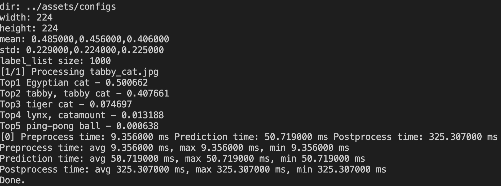
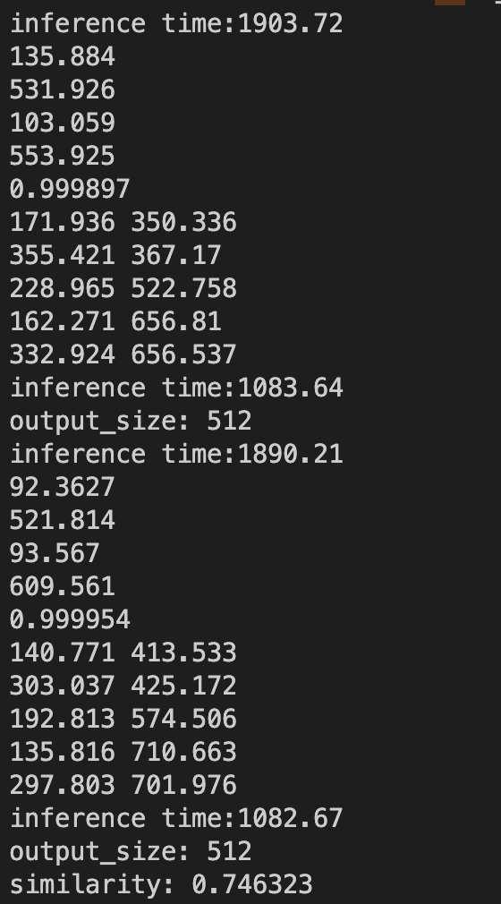
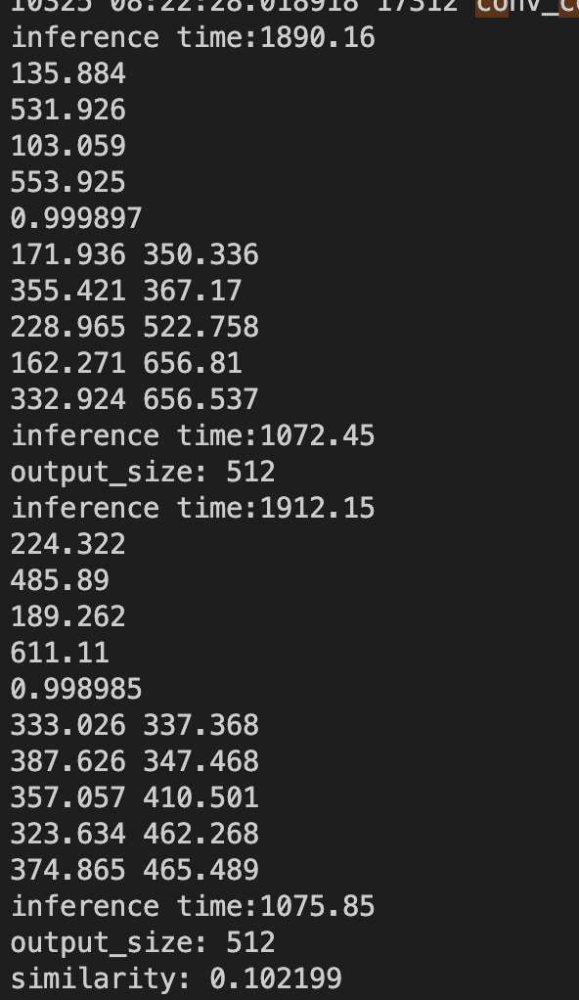

# Paddle Face Recognition Test

## python code 
- [arcface github Link](https://github.com/deepinsight/insightface/blob/master/python-package/insightface/model_zoo/arcface_onnx.py)
- [retinaface github Link](https://github.com/deepinsight/insightface/blob/master/python-package/insightface/model_zoo/retinaface.py)
- [MNN inference Link](https://github.com/PLLin/face_recognition_mnn)


## Phase1: 測試結果
- 

## Phase2: 測試



## 環境
起 docker
``` shell
docker run -it --name paddle_lite -v $PWD/Paddle-Lite:/Paddle-Lite  ubuntu:20.04 bash
```
進入 docker 後，建置環境
```
echo "check_certificate = off" >> ~/.wgetrc
export GIT_SSL_NO_VERIFY=1
# 1. 安装 gcc g++ git make wget python unzip curl等基础软件
apt update
apt-get install -y --no-install-recommends \
  gcc g++ git make wget python unzip curl

# 2. 安装 CMake，以下命令以 3.10.3 版本为例，其他版本步骤类似。
wget -c https://mms-res.cdn.bcebos.com/cmake-3.10.3-Linux-x86_64.tar.gz && \
    tar xzf cmake-3.10.3-Linux-x86_64.tar.gz && \
    mv cmake-3.10.3-Linux-x86_64 /opt/cmake-3.10 &&
    ln -s /opt/cmake-3.10/bin/cmake /usr/bin/cmake && \
    ln -s /opt/cmake-3.10/bin/ccmake /usr/bin/ccmake
```

或是直接使用 OCI
`docker exec -it paddle_lite bash`

## 執行
如果有修改程式碼，或是資料夾沒有 `build.linux.amd64` 資料夾，則需要執行以下程式碼
```
./build.sh linux amd64
```
執行後，即可以 inference
```
./run.sh ../assets/models/Pytorch_RetinaFace_resnet50.nb  ../assets/models/face_model.nb /opt/fr_data/yiren2.png /opt/fr_data/huli1_full.png
```

## model 轉換的部分
onnx -> paddlelite
1. [x2paddle](https://www.paddlepaddle.org.cn/lite/develop/user_guides/model_optimize_tool.html)
x2paddle --framework=onnx --model=onnx_model.onnx --save_dir=pd_model --to_lite=True --lite_valid_places=arm --lite_model_type=naive_buffer
> 但不知道執行到 lite 會出錯，所以只好再多做一步

2. [paddle_lite_opt](https://github.com/PaddlePaddle/Paddle-Lite/blob/develop/docs/user_guides/opt/opt_python.md)
```shell
paddle_lite_opt --model_dir=/Users/wangyiting/Documents/ESB/computer_vision/c++/inference_model \
      --valid_targets=x86 \
      --optimize_out=mobilenet_v1_opt
```
